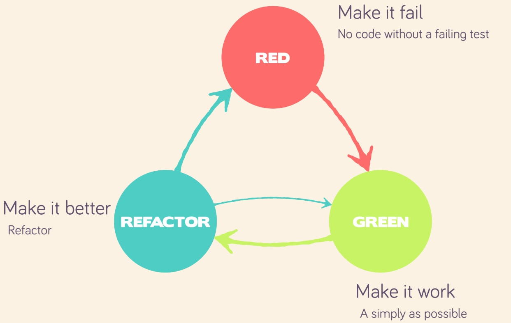
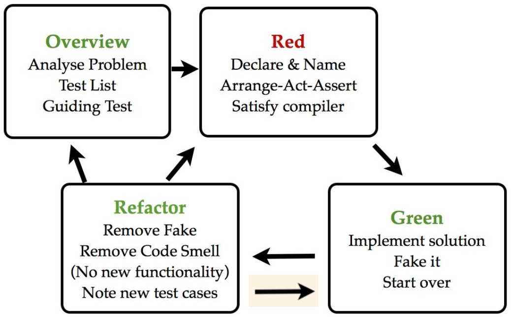

---?image=resources/img/arolla-software-craftsmanship.jpg

# Formation TDD

Note: 
Faire un tour de table, se présenter, demander pourquoi les gens sont là.

---

## Pourquoi le TDD ?

Note: 
Pourquoi on teste ? TDD selon vous ? (permet de voir si public sensibilisé)
-> ce n'est pas au client de tester
-> preuve que cela marche dans des conditions (de tests)
-> confiance - image de soi/société

+++


---

#### Comment on teste ?

- Manuel vers Automatique
- QA pour la conception, Dev pour la réalisation
- Tests à postériori vers Tests avant implémentation

---

#### TDD : Les promesses (le ROI)

- Documentation vivante Agile
- Spécification technique par l’exemple
- Outil de design ?

Note:
Dans le même repo que le code de production : synchronisée
Exécutable : sa validation est à jour
L’intégration continue, valide cette spécification systématiquement
Documentation c'est les tests, ce sont des exemples

Spécifications par l'exemple, ATDD, on prouve (à soi et au métier s'il faut)
BBD peut être vu comme une spécification fonctionnelle vivante et agile
Écrite avant le code pour implémenter et maintenir la fonctionnalité
Vérifie le comportement attendu, pas les détails d’implémentation

Les mocks/stubs servent à définir l’usage des composants de votre architecture
Outil, et non la silver bullet. Donc ça aide, mais ne fait pas la travail à votre place.
Outil de VOTRE design que vous faites « émerger »

---

#### La méthodologie


"Agilité appliquée au développement"

Note:
3 lois du TDD => Secondes / Minutes
Red/green/refactor => 10aines de minutes
Green/Refactor/green => Secondes / Minutes
Acceptance tests (BDD ou autre) => Heures
Aka « double loop TDD »

+++

#### 3 lois du TDD

1. Vous ne devez pas écrire du code de production avant d’avoir écrit un test en échec.
2. Vous ne devez pas écrire plus de test unitaire que le minimum pour qu’il échoue et ne pas compiler est un échec.
3. Vous ne devez pas écrire plus de code de production que le minimum pour faire passer le test unitaire actuellement en échec.

+++

 

+++

#### Boucle Red - Green - Refactor 

 

+++

#### Inside Out

(Classic Chicago school, bottom-up)

#### Outside In

(London School, top-down, mockist TDD)

+++

#### Double loop TDD

 

---

#### Anatomie d'un test
```
@Test
public void should_be_able_to_send_an_email() throws Exception {
    //
    // GIVEN
    //
    Session session = Session.getInstance(new Properties(), null);
    Message msg = createMessage(session);

    //
    // WHEN
    //
    sendMessage(session, msg);

    //
    // THEN
    //     fetch messages from server
    MimeMessage[] messages = mailServer.getReceivedMessages();
    assertThat(messages).hasSize(1);
    assertThat(messages[0].getSubject()).isEqualTo(EMAIL_SUBJECT);
    assertThat(messages[0].getContent().toString().trim()).isEqualTo(EMAIL_TEXT);
    assertThat(messages[0].getFrom()[0].toString()).isEqualTo(EMAIL_TO);
}
```
@[1-22]
@[2](Should)
@[3-7](Arrange)
@[8-11](Act)
@[13-20](Assert/Verify)

Note:
Should
Arrange
Act
Assert/Verify