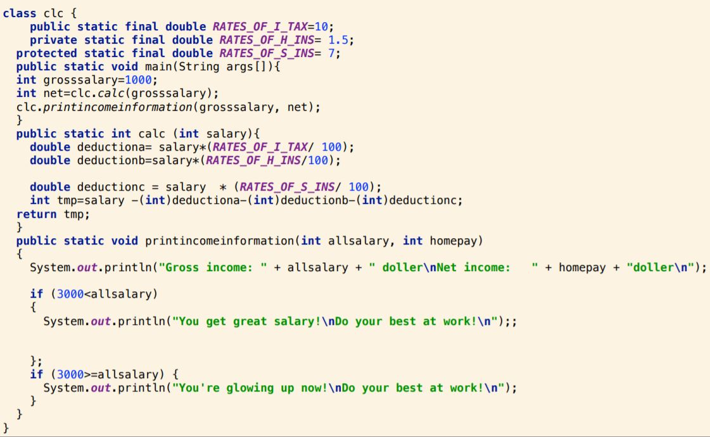
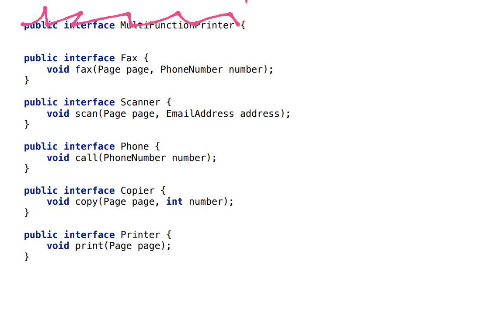

---?image=resources/img/arolla-software-craftsmanship.jpg

# Formation Clean Code

Note: 
Faire un tour de table, se présenter, demander pourquoi les gens sont là.

---

## C'est quoi le Clean Code ?

Note: 
tour de table, on demande à chacun ce qu'il pense

+++

+++

+++

> "Any fool can write code that a computer can understand.Good programmers write code that humans can understand."

_Martin Fowler_

+++

> “Always code as if the guy who ends up maintaining your code will be a violent psychopath who knows where you live.”

_Martin Golding_

+++

#### Broken Windows Theory

+++

> “Clean code always looks like it was written by someone who cares.”

_Michael Feathers_

---

Note:
La formation est inspiré de ce livre, où les cas que l'on va voir sont étudiés plus en profondeur

---

#### Meaningful Name

- Use Intention Revealing Names
- Use pronounceable names
- No magical number
- Avoid Encoding (Hungarian notation)
- Avoid Mental Mapping
- Class names use only nouns
(try avoiding words like Manager, Data, Info)
- Method Names must contain a verb

+++ 

#### Comments

+++

+++

#### Formatting

- Indentation
- Error Handling
- Code Convention

+++

---

---

# SLAP

+++

Note:
Single Level of Abstraction Principle
On mélande ici des méthodes d'accès direct à une base de données et des méthodes métiers.
Cela rend le code difficile à lire, car on doit mentalement changer de monde.

+++

---

# S.O.L.I.D.

Note:
Principes pour l'orienté objet, recommandations d'expert dans le domaine.
Facilite la maintenant, l'évolution, l'adaptation, la scalabilité et le design des applications.

---

## S.O.L.I.D.

#### SRP

+++

+++

+++

+++

#### Single Responsibility Principle

###### A class should have one and only one reason to change, meaning that a class should have only one job.

Smells : 

<ul class="smallerFont">
<li>Large Class</li>
<li>Long Method</li>
<li>Lot of methods</li>
<li>High Coupling/Low cohesion</li>
<li>Helper class</li>
<li>Multiple functional/technical concepts at the same place</li>
</ul>

---

## S.O.L.I.D.

#### OCP

+++

Note:
the method have to be changed each time we want to add support for a new directive. It’s therefore not closed for modification.
chaque cas du switch peut être mis à part dans une classe commande, où on lui passe le contexte

+++

+++

+++

Note:
Notez la composition des filtres

+++

#### Open Closed Principle

###### Objects or entities should be open for extension, but closed for modification.

Smells : 

<ul class="smallerFont">
<li>High cyclomatic complexity</li>
<li>Complex switch/Lot of ifs </li>
<li>Heavy use of polymorphism</li>
</ul>

---

## S.O.L.I.D.

#### LSP

+++

+++

+++

#### Liskov Substitution Principle

###### Let q(x) be a property provable about objects of x of type T. Then q(y) should be provable for objects y of type S where S is a subtype of T.

Smells : 

<ul class="smallerFont">
<li>You have to check for the type provided (e.g. instanceof)</li>
<li>Every subclass/derived class should be substitutable for their base/parent class</li>
</ul>

+++

#### Liskov Substitution Principle

###### if S is a subtype of T, an object of type T may be substituted with any object of a subtype S

###### without altering any of the desirable properties of T (correctness, task performed, etc.)

Smells : 

<ul class="smallerFont">
<li>You have to check for the type provided (e.g. instanceof)</li>
<li>Every subclass/derived class should be substitutable for their base/parent class</li>
</ul>

---

Note:
C'est bon vous suivez toujours ?

---

## S.O.L.I.D.

#### ISP

+++

+++

+++

+++

+++

+++

#### Interface Segregation Principle

###### A client should never be forced to implement an interface that it doesn’t use
or
###### clients shouldn’t be forced to depend on methods they do not use

Smells : 

<ul class="smallerFont">
<li>Fat interface/Class with lot of methods</li>
<li>Interface has multiple responsibilities</li>
<li>Difficulties to expose a subset of responsibilities</li>
</ul>

---

## S.O.L.I.D.

#### DIP

+++

+++

+++

#### Dependency Inversion Principle

###### Entities must depend on abstractions not on concretions. 

###### It states that the high level module must not depend on the low level module, but they should depend on abstractions.

Smells : 

<ul class="smallerFont">
<li>Dependencies between classes (vs interface)</li>
<li>Monolithic architecture</li>
<li>Abstraction depends on details/implementation</li>
</ul>

+++

#### How to inject with Spring and Annotations !

###### (joking)

+++

---

---

#### YAGNI

###### You Ain't Gonna Need It

+++

#### KISS

###### Keep It SImple Stupid

+++

#### DRY

###### Don't Repeat Yourself

---

#### Go Further

+++

---

#### RPN Calculator

###### Calisthenics

###### Review

+++

#### Calisthenics

- Only One Level Of Indentation Per Method
- Don’t Use The ELSE Keyword
- Wrap All Primitives And Strings
- First Class Collections
- One Dot Per Line
- Don’t Abbreviate
- Keep All Entities Small
- No Classes With More Than Two Instance Variables
- No Getters/Setters/Properties

http://williamdurand.fr/2013/06/03/object-calisthenics/

---

#### Birthday Greeting Kata

Problem: write a program that
- Loads a set of employee records from a flat file
- Sends a greetings email to all employees whose birthday is today

+++

+++

+++

+++

